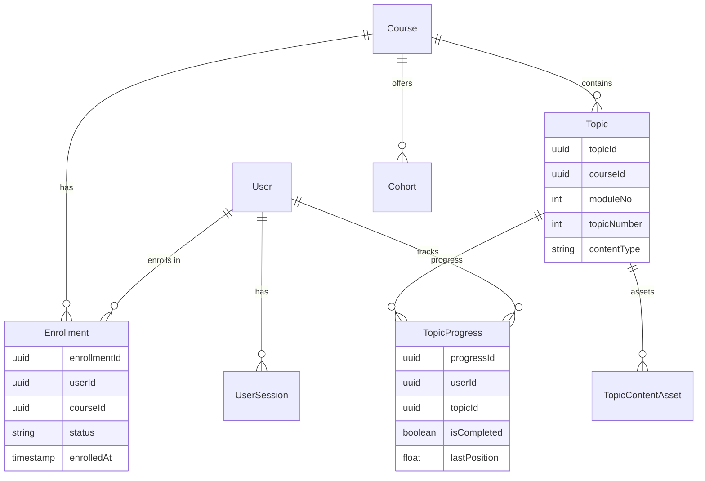
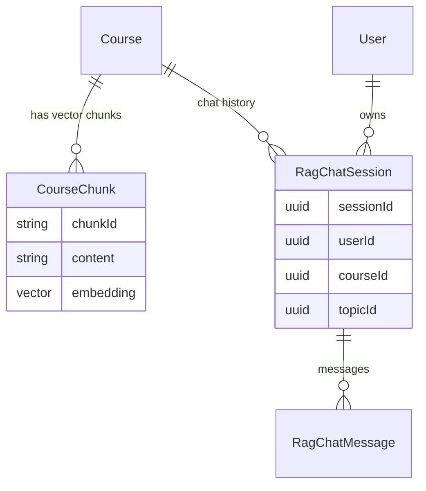

# Database Schema Documentation

## 1. Overview
The database is PostgreSQL, managed via Prisma ORM. It supports the core learning platform, AI tutor (via `pgvector`), and auxiliary systems like the job queue.

## 2. Entity-Relationship Diagram (ERD)

### 2.1 Core Learning Domain
Users, Courses, Enrollments, and Topics.

### 2.2 AI & RAG Domain
Vector storage and chat history.

## 3. Table Reference

### Core Tables
| Table | Description | Key Columns |
|---|---|---|
| `users` | All platform users (learners, tutors, admins). | `user_id`, `email`, `role`, `password_hash` |
| `courses` | Course catalog data. | `course_id`, `slug`, `price_cents`, `is_published` |
| `topics` | Content units within courses. | `topic_id`, `course_id`, `text_content`, `video_url` |
| `enrollments` | Links users to courses. | `enrollment_id`, `user_id`, `course_id` |
| `topic_progress` | User progress usage per topic. | `user_id`, `topic_id`, `is_completed` |

### AI & RAG
| Table | Description | Key Columns |
|---|---|---|
| `course_chunks` | **Vector Store**. Embeddings of course content. | `chunk_id`, `embedding` (vector(1536)) |
| `cp_rag_chat_sessions` | AI Tutor chat sessions. | `session_id`, `user_id`, `topic_id`, `summary` |
| `cp_rag_chat_messages` | Individual chat messages. | `message_id`, `role` (user/assistant), `content` |
| `background_jobs` | **Async Job Queue**. Tracks LLM tasks. | `job_id`, `status` (PENDING/COMPLETED), `payload` |

### Registration & Cohorts
| Table | Description | Key Columns |
|---|---|---|
| `cohorts` | Time-bound groups for courses. | `cohort_id`, `start_date`, `is_active` |
| `cohort_members` | Users assigned to a cohort. | `user_id`, `cohort_id`, `batch_no` |
| `registrations` | Multi-stage registration entries. | `registration_id`, `email`, `status`, `answers_json` |
| `course_offerings` | Specific offerings (Cohort/Workshop) for registration. | `offering_id`, `program_type` |

### Personalization
| Table | Description | Key Columns |
|---|---|---|
| `learner_persona_profiles` | AI-analyzed learner type (e.g., "Rote Memorizer"). | `persona_key`, `analysis_summary` |
| `topic_personalization` | User-selected textual flavor (e.g., "Sports"). | `study_persona` |
| `topic_content_assets` | Persona-specific content overrides. | `content_key`, `persona_key`, `payload` |

### Auth & Commerce
| Table | Description | Key Columns |
|---|---|---|
| `user_sessions` | Refresh tokens for JWT rotation. | `jwt_id`, `refresh_token_hash` |
| `cart_items` | Temporary cart storage. | `cart_item_id`, `course_slug` |
| `tutors` | Profile data for tutor users. | `tutor_id`, `bio`, `specialization` |
