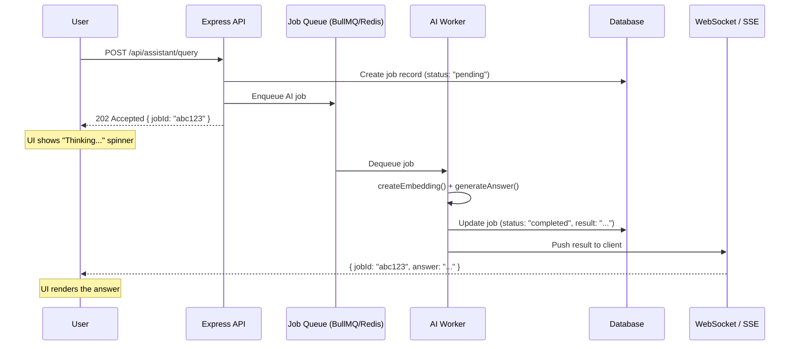

# Blocking AI Crisis: Analysis & Async Architecture Proposal

## 1. Problem Statement

Our backend makes **synchronous OpenAI API calls inside HTTP request handlers**. Every user request that triggers AI (chat, persona classification, tutor copilot) **blocks** the Express thread for 3–8 seconds while waiting for the LLM response. This creates a direct coupling between user experience and external API latency.

---

## 2. Identified Blocking Call Sites

We identified **5 distinct blocking chains** across the codebase. Each one holds an HTTP connection open while waiting for OpenAI.

### Blocking Call Map

| # | Entry Point (Route/Service) | Blocking Function(s) Called | OpenAI Calls per Request | Est. Latency |
|---|---|---|---|---|
| 1 | `POST /api/assistant/query` → `assistantService.ts:315` | `askCourseAssistant()` → `createEmbedding()` + `generateAnswerFromContext()` | **2** (Embedding + Chat) | 3–8s |
| 2 | `POST /api/assistant/query` → `assistantService.ts:302,150` | `rewriteFollowUpQuestion()` + `summarizeConversation()` (conditional) | **1–2** (Chat) | 2–5s |
| 3 | `POST /api/landing-assistant/query` → `landingAssistant.ts:36` | `generateLandingPageAnswer()` | **1** (Chat) | 2–4s |
| 4 | `POST /api/tutors/.../copilot` → `tutors.ts:126` | `generateTutorCopilotAnswer()` | **1** (Chat) | 2–4s |
| 5 | Persona Profile Flow → `personaProfileService.ts:60` | `classifyLearnerPersona()` | **1** (Chat) | 1–3s |

### The Worst Offender: Assistant Query (Sites #1 + #2)

The `/api/assistant/query` endpoint is the most dangerous because it chains **up to 4 sequential OpenAI calls** in a single HTTP request:

```
User Request (HTTP)
  │
  ├─ await rewriteFollowUpQuestion()     ← OpenAI Chat   (~2s)
  ├─ await createEmbedding()             ← OpenAI Embed  (~0.5s)
  ├─ await generateAnswerFromContext()   ← OpenAI Chat   (~3s)
  └─ await summarizeConversation()       ← OpenAI Chat   (~2s)  [every 16 messages]
  │
  └─ HTTP Response sent (total: 5–8s later)
```

### Source Files

| File | Path | Role |
|---|---|---|
| [openAiClient.ts](file:///d:/BunnY/OTTOBON%20Projects/Course%20Platform%20System%20Design/backend/src/rag/openAiClient.ts) | `backend/src/rag/openAiClient.ts` | All OpenAI SDK calls live here |
| [ragService.ts](file:///d:/BunnY/OTTOBON%20Projects/Course%20Platform%20System%20Design/backend/src/rag/ragService.ts) | `backend/src/rag/ragService.ts` | `askCourseAssistant()` – RAG orchestrator |
| [assistantService.ts](file:///d:/BunnY/OTTOBON%20Projects/Course%20Platform%20System%20Design/backend/src/services/assistantService.ts) | `backend/src/services/assistantService.ts` | Calls RAG + rewrite + summarize |
| [personaProfileService.ts](file:///d:/BunnY/OTTOBON%20Projects/Course%20Platform%20System%20Design/backend/src/services/personaProfileService.ts) | `backend/src/services/personaProfileService.ts` | `classifyLearnerPersona()` |
| [tutors.ts](file:///d:/BunnY/OTTOBON%20Projects/Course%20Platform%20System%20Design/backend/src/routes/tutors.ts) | `backend/src/routes/tutors.ts` | Tutor copilot chat |
| [landingAssistant.ts](file:///d:/BunnY/OTTOBON%20Projects/Course%20Platform%20System%20Design/backend/src/routes/landingAssistant.ts) | `backend/src/routes/landingAssistant.ts` | Landing page AI chatbot |

---

## 3. Why This Is Dangerous

### 3.1 Connection Exhaustion
Node.js (Express) uses a single-threaded event loop. While `await`-ing OpenAI, the **HTTP connection stays open**. With 100 concurrent users chatting:
- **100 open TCP connections** held for 5–8 seconds each.
- Server memory grows linearly with concurrent users.
- Nginx/load balancer timeouts fire at 30–60s, dropping requests.

### 3.2 Cascading Failures
If OpenAI's API slows down (common during peak hours):
- Response times jump from 5s → 15s → 30s.
- Connection pool fills up, NEW requests (even non-AI ones like fetching lessons) start queueing.
- The entire platform becomes unresponsive, even for users not using AI features.

### 3.3 No Retry / No Backpressure
Currently, if OpenAI returns a 429 (rate limit) or 503 (overloaded):
- The error propagates directly to the user as a 500.
- There's no retry logic, no circuit breaker, no graceful degradation.
- The user sees "Something went wrong" with no recovery path.

### 3.4 Violation of Architectural Principles
- **Message-Oriented Pattern**: The current design is request-reply, not fire-and-forget.
- **Separation of Concerns**: The HTTP handler is coupled to LLM latency.
- **Scalability**: Cannot scale AI workload independently from serving web pages.

---

## 4. Proposed Solution: Async "Fire-and-Forget" Architecture

### High-Level Flow



### Components

| Component | Role | Technology |
|---|---|---|
| **Producer** (API Server) | Validates input, creates job, returns 202 immediately | Express (existing) |
| **Queue** | Stores jobs, handles retries, rate limiting | BullMQ + Redis |
| **Consumer** (Worker) | Processes AI jobs off the queue, calls OpenAI | Separate Node.js process |
| **Notifier** | Pushes results back to client | WebSocket or Server-Sent Events (SSE) |

### Key Benefits

1. **Instant Response**: User gets `202 Accepted` in <100ms instead of waiting 5–8s.
2. **Backpressure**: Queue naturally throttles; if 1000 jobs arrive, workers process them at their own pace.
3. **Retries**: Failed OpenAI calls are automatically retried with exponential backoff.
4. **Scalability**: Spin up more workers independently from web servers.
5. **Resilience**: If OpenAI is down, jobs stay in queue and retry later; the web server stays healthy.

### Priority Ranking (Which to Migrate First)

| Priority | Endpoint | Reason |
|---|---|---|
| 🔴 P0 | `/api/assistant/query` | Highest latency (4 chained calls), most used by learners |
| 🟡 P1 | `/api/tutors/.../copilot` | Used by tutors during live sessions, latency-sensitive |
| 🟡 P1 | `/api/landing-assistant/query` | Public-facing, first impression for new users |
| 🟢 P2 | Persona Classification | One-time per user, can tolerate async |

---

## 5. Conclusion

The current "Naive Happy Path" architecture makes the platform fragile under load. The fix is to **decouple AI computation from the HTTP lifecycle** using a job queue. This is a standard pattern (used by ChatGPT, GitHub Copilot, etc.) and maps cleanly onto our existing service layer.

**No code changes are proposed in this document. This is a design-only analysis.**
