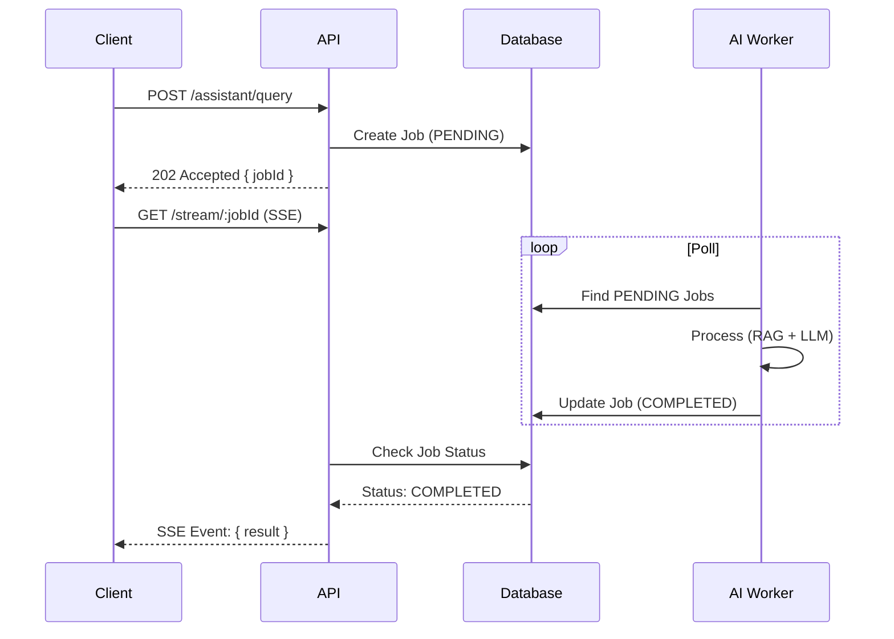
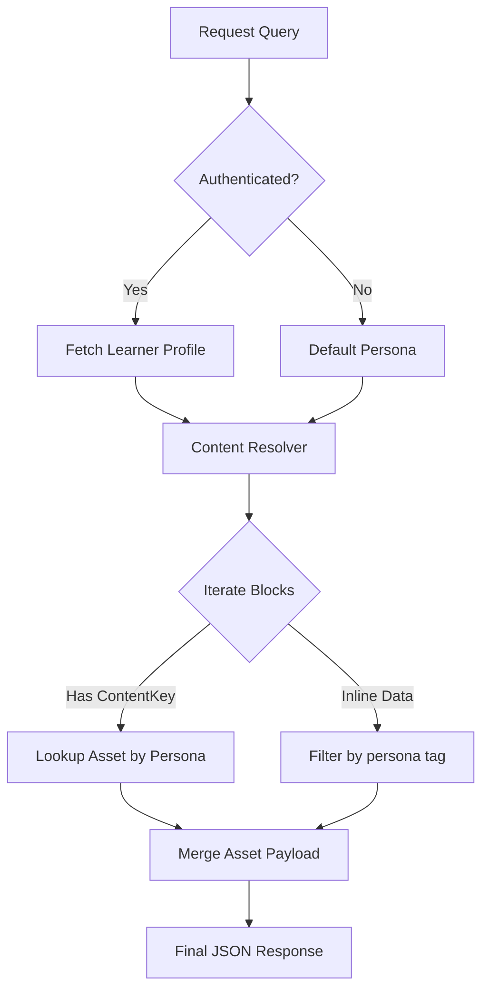

# Course Platform System Design

## 1. Executive Summary
The Course Platform is a full-stack learning management system designed to deliver AI-native courses. It features a React-based frontend and an Express/Node.js backend, utilizing PostgreSQL for data storage and OpenAI for AI-driven features. The system supports personalized learning experiences through "personas" and includes a sophisticated RAG (Retrieval-Augmented Generation) pipeline for an AI Tutor.

## 2. System Architecture

### 2.1 Runtime Topology
The application follows a standard three-tier architecture:

```mermaid
graph LR
    User[Browser / User] -->|HTTPS| CDN[CDN / Assets]
    User -->|HTTPS| FE[React Frontend (Vite)]
    FE -->|REST API / SSE| API[Express Backend]
    
    subgraph Backend Cloud
        API -->|Query| DB[(PostgreSQL + pgvector)]
        API -->|Async Job| Queue[Job Queue (DB)]
        Worker[AI Worker] -->|Poll| Queue
        Worker -->|Update| DB
    end
    
    subgraph External Services
        API -->|Auth| Google[Google OAuth]
        Worker -->|LLM Calls| OpenAI[OpenAI API]
    end
```

### 2.2 Core Components
1.  **Frontend**: Single Page Application (SPA) built with React, TypeScript, and Vite. Uses Tailwind CSS for styling and TanStack Query for state management.
2.  **Backend**: RESTful API built with Node.js and Express. Handles authentication, course content delivery, and AI orchestration.
3.  **Database**: PostgreSQL hosted on Supabase. Uses Prisma ORM for data access and `pgvector` for vector similarity search (RAG).
4.  **Async Engine**: a custom-built job queue system using PostgreSQL to handle long-running AI tasks, with Server-Sent Events (SSE) for real-time updates.

---

## 3. Detailed Architecture

### 3.1 Frontend Architecture
The frontend is organized by pages and features, with a strong emphasis on component reusability.

-   **Routing**: `wouter` handles client-side routing.
-   **State Management**: `TanStack Query` caching server state; `localStorage` for session persistence.
-   **Key Pages**:
    -   `CoursePlayerPage`: The core learning interface, rendering JSON-based content blocks.
    -   `TutorDashboardPage`: For tutors to monitor learner progress.
    -   `LandingPage`: Public-facing marketing page with an embedded AI sales chatbot.

### 3.2 Backend Architecture
The backend is structured around a "Router-Service-Controller" pattern.

-   **App Bootstrap**: `app.ts` mounts 19 routers.
-   **Routers**: Segregated by domain (e.g., `auth`, `courses`, `lessons`, `assistant`).
-   **Services**: Business logic layer (e.g., `ragService`, `enrollmentService`).
-   **Middleware**: Handles authentication (`requireAuth`) and error handling.

#### Async Job Queue & SSE
To prevent timeouts during long LLM operations (Prompt Engineering + RAG), the system uses an asynchronous job queue.



### 3.3 Content Pipeline & Resolution
Content is stored as JSON blocks in the database (`topics` table). The backend dynamically "resolves" this content based on the learner's assigned **Tutor Persona**.

-   **Master Content**: Stored in `topics.text_content`.
-   **Assets**: Specialized content chunks (e.g., a "sports-themed" explanation) stored in `topic_content_assets`.
-   **Resolution Logic**:
    1.  Fetch topic content.
    2.  Identify user's Tutor Persona (e.g., `non_it_migrant`, `rote_memorizer`).
    3.  Replace generic blocks with persona-specific assets from `topic_content_assets`.
    4.  Serve resolved JSON to frontend.



---

## 4. Key Systems

### 4.1 Persona System
The platform personalizes learning in two dimensions:
1.  **Study Persona** (Client-side): "Normal", "Sports", "Cooking", "Adventure". Changes the *text flavor* of the content. Toggled by the user.
2.  **Tutor Persona** (Server-side): "Non-IT Migrant", "Rote Memorizer", etc. Determined by an LLM analysis of a registration survey. Changes the *structural content* and *AI Tutor prompts*.

### 4.2 RAG (Retrieval-Augmented Generation) Pipeline
Used for the AI Tutor (`/assistant`) and Landing Chatbot.
1.  **Ingestion**: Course content (PDFs/JSON) is chunked and embedded using OpenAI `text-embedding-3-small`.
2.  **Storage**: Vectors stored in `course_chunks` table.
3.  **Retrieval**: `pgvector` similarity search finds relevant chunks.
4.  **Generation**: Context + User Query sent to `gpt-3.5-turbo`. PII scrubbing is applied before sending data.

### 4.3 Registration & Cohorts
-   **Cohorts**: Users are grouped into time-bound cohorts.
-   **Gating**: Access to content is strictly gated by cohort membership.
-   **Registration**: A multi-stage flow collecting user details and assessment answers, stored in `registrations`.
